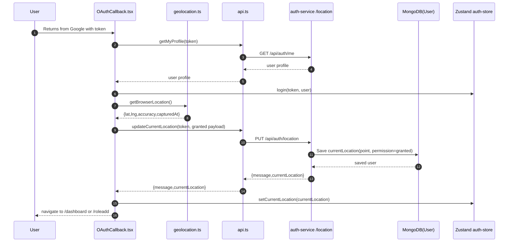
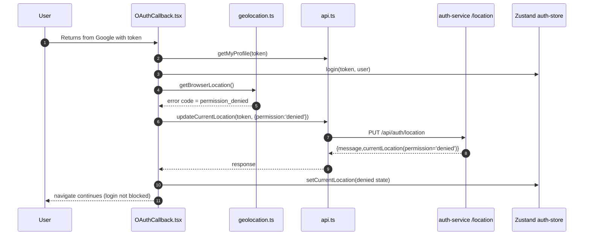
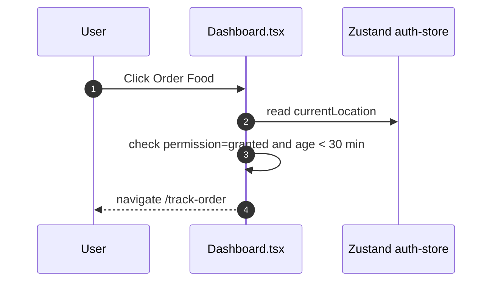
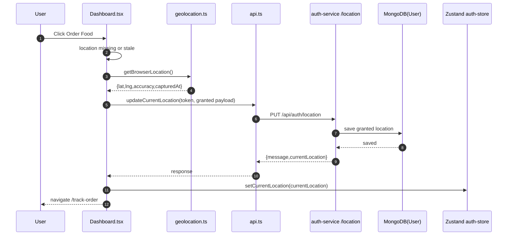
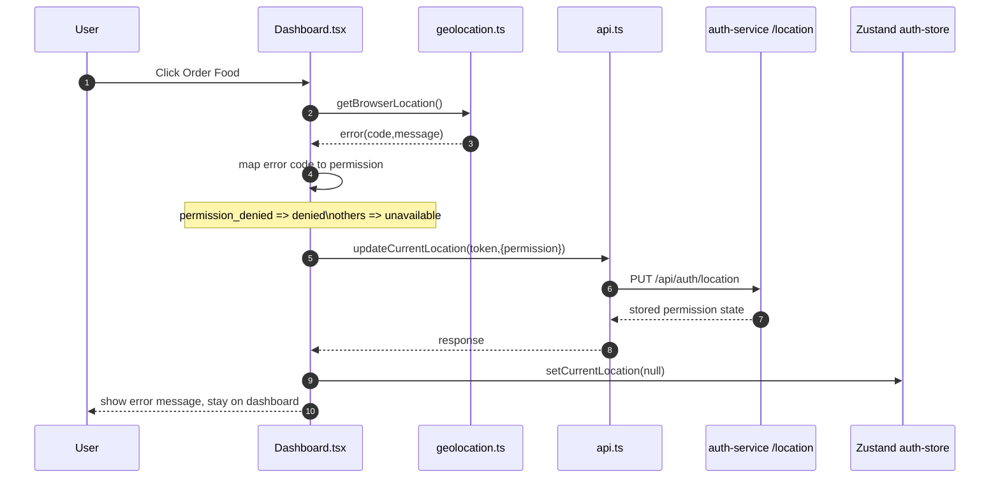

# Geolocation Sequence Guide

This is a companion to [geolocation.md](geolocation.md).

Use this file to understand the exact runtime flow in sequence-diagram style, from browser to frontend state to backend persistence.

## Components In The Flow

- Browser Geolocation API
- Frontend geolocation wrapper: [frontend/src/services/geolocation.ts](frontend/src/services/geolocation.ts)
- Frontend OAuth callback flow: [frontend/src/pages/OAuthCallback.tsx](frontend/src/pages/OAuthCallback.tsx)
- Frontend dashboard order gate: [frontend/src/pages/Dashboard.tsx](frontend/src/pages/Dashboard.tsx)
- Frontend auth store: [frontend/src/context/auth-context.ts](frontend/src/context/auth-context.ts)
- Frontend API layer: [frontend/src/services/api.ts](frontend/src/services/api.ts)
- Backend routes: [services/auth-service/src/routes/authroute.ts](services/auth-service/src/routes/authroute.ts)
- Backend controller: [services/auth-service/src/controller/authcontroller.ts](services/auth-service/src/controller/authcontroller.ts)
- Backend model: [services/auth-service/src/model/user.ts](services/auth-service/src/model/user.ts)

## Scenario 1: Login Callback With Geolocation Granted

### Mermaid Sequence



### What to notice

1. Login and location are decoupled:

- Login state is saved before geolocation call.

2. Geolocation payload is persisted server-side:

- The server becomes the durable source of location history state.

3. Store hydration:

- Zustand keeps currentLocation for client-side gating checks.

## Scenario 2: Login Callback With Permission Denied

### Mermaid Sequence



### Why this behavior is intentional

- Authentication should not fail only because geolocation failed.
- Blocking is deferred to action-time (Order Food click), not login-time.

## Scenario 3: Dashboard Order Food With Fresh Location

### Mermaid Sequence



### Gate condition in words

Dashboard allows immediate navigation only when:

- permission is granted
- currentLocation.capturedAt is within LOCATION_STALE_MS (30 minutes)

## Scenario 4: Dashboard Order Food With Stale/Missing Location and Success

### Mermaid Sequence



### UX behavior

- Button becomes loading state (Checking your location...).
- On success, navigation continues automatically.

## Scenario 5: Dashboard Order Food With Geolocation Error

Covers permission denied, timeout, position unavailable, unsupported, unknown.

### Mermaid Sequence



### Key learning point

This is optimistic retry with strict gate:

- It attempts to recover in real time.
- If not possible, it records failure state and blocks progression.

## Backend Validation Flow (PUT /api/auth/location)

### Step-by-step logic from controller

Source: [services/auth-service/src/controller/authcontroller.ts](services/auth-service/src/controller/authcontroller.ts)

1. Verify authenticated user context from JWT.
2. Validate permission enum.
3. Branch by permission:

- denied/unavailable:
  - Save metadata only: capturedAt, source, permission.
- granted:
  - Require latitude and longitude.
  - Validate lat/lng ranges.
  - Validate accuracy if present.
  - Validate capturedAt date if present.
  - Save GeoJSON point with coordinates [longitude, latitude].

4. Return 200 with currentLocation object.

## Frontend Error Mapping Rules

Source: [frontend/src/services/geolocation.ts](frontend/src/services/geolocation.ts)

Browser error to app error mapping:

- PERMISSION_DENIED -> permission_denied
- POSITION_UNAVAILABLE -> position_unavailable
- TIMEOUT -> timeout
- no navigator.geolocation -> unsupported
- fallback -> unknown

App error to backend permission mapping:

- permission_denied -> denied
- position_unavailable | timeout | unsupported | unknown -> unavailable

## State Evolution Table

| Stage                     | user | token | currentLocation             | Meaning                    |
| ------------------------- | ---- | ----- | --------------------------- | -------------------------- |
| Before login              | null | null  | null                        | Unauthenticated            |
| After profile fetch       | user | token | null                        | Logged in, no location yet |
| After geolocation granted | user | token | granted + point             | Can pass gate if fresh     |
| After denied/unavailable  | user | token | denied/unavailable metadata | Must retry before ordering |
| After logout              | null | null  | null                        | Store cleared              |

## Practical Debug Checklist

1. Browser did not prompt:

- Confirm site is secure context (https or localhost).
- Confirm permission was not previously blocked globally.

2. API updates failing:

- Check Authorization header in requests from [frontend/src/services/api.ts](frontend/src/services/api.ts).
- Verify backend route registration in [services/auth-service/src/routes/authroute.ts](services/auth-service/src/routes/authroute.ts).

3. Location saved but gate still blocks:

- Verify capturedAt freshness against 30-minute window in [frontend/src/pages/Dashboard.tsx](frontend/src/pages/Dashboard.tsx).
- Check currentLocation in localStorage auth-storage and in /api/auth/me response.

4. MongoDB shape mismatch:

- Verify User schema and index in [services/auth-service/src/model/user.ts](services/auth-service/src/model/user.ts).

## Code Reading Order For Learning

1. [frontend/src/services/geolocation.ts](frontend/src/services/geolocation.ts)
2. [frontend/src/services/api.ts](frontend/src/services/api.ts)
3. [frontend/src/context/auth-context.ts](frontend/src/context/auth-context.ts)
4. [frontend/src/pages/OAuthCallback.tsx](frontend/src/pages/OAuthCallback.tsx)
5. [frontend/src/pages/Dashboard.tsx](frontend/src/pages/Dashboard.tsx)
6. [services/auth-service/src/routes/authroute.ts](services/auth-service/src/routes/authroute.ts)
7. [services/auth-service/src/controller/authcontroller.ts](services/auth-service/src/controller/authcontroller.ts)
8. [services/auth-service/src/model/user.ts](services/auth-service/src/model/user.ts)

This order follows real execution direction: user action -> browser API -> frontend API call -> backend validation -> database persistence.

## Local API Testing With curl

Use these commands to simulate backend behavior without clicking through the UI.

### 1) Set your token and base URL

```bash
export API_BASE="http://localhost:5000/api"
export TOKEN="PASTE_YOUR_JWT_HERE"
```

If you are running with a different port, update API_BASE.

### 2) Read current user profile (includes currentLocation)

```bash
curl -sS "$API_BASE/auth/me" \
    -H "Authorization: Bearer $TOKEN" | jq
```

### 3) Simulate granted location

```bash
curl -sS -X PUT "$API_BASE/auth/location" \
    -H "Authorization: Bearer $TOKEN" \
    -H "Content-Type: application/json" \
    -d '{
        "latitude": 23.8103,
        "longitude": 90.4125,
        "accuracyMeters": 18,
        "capturedAt": "2026-04-11T09:20:00.000Z",
        "permission": "granted"
    }' | jq
```

Expected:

- HTTP 200
- message: Current location updated
- currentLocation.point.coordinates saved as [longitude, latitude]

### 4) Simulate denied permission

```bash
curl -sS -X PUT "$API_BASE/auth/location" \
    -H "Authorization: Bearer $TOKEN" \
    -H "Content-Type: application/json" \
    -d '{ "permission": "denied" }' | jq
```

Expected:

- HTTP 200
- message: Location permission state stored
- currentLocation has permission and metadata, no point required

### 5) Simulate unavailable location

```bash
curl -sS -X PUT "$API_BASE/auth/location" \
    -H "Authorization: Bearer $TOKEN" \
    -H "Content-Type: application/json" \
    -d '{ "permission": "unavailable" }' | jq
```

### 6) Simulate validation error (invalid latitude)

```bash
curl -sS -X PUT "$API_BASE/auth/location" \
    -H "Authorization: Bearer $TOKEN" \
    -H "Content-Type: application/json" \
    -d '{
        "latitude": 999,
        "longitude": 90.4125,
        "permission": "granted"
    }' | jq
```

Expected:

- HTTP 400
- error: Invalid latitude or longitude range

### 7) Simulate validation error (missing coordinates for granted)

```bash
curl -sS -X PUT "$API_BASE/auth/location" \
    -H "Authorization: Bearer $TOKEN" \
    -H "Content-Type: application/json" \
    -d '{ "permission": "granted" }' | jq
```

Expected:

- HTTP 400
- error: Latitude and longitude are required for granted permission

### 8) Fetch stored location directly

```bash
curl -sS "$API_BASE/auth/location" \
    -H "Authorization: Bearer $TOKEN" | jq
```

Expected:

- HTTP 200
- currentLocation object (or null if never set)

### 9) Simulate unauthorized call

```bash
curl -sS -X PUT "$API_BASE/auth/location" \
    -H "Content-Type: application/json" \
    -d '{ "permission": "denied" }' | jq
```

Expected:

- HTTP 401

## Suggested Learning Exercise

1. Run command 3 and command 8, observe saved point data.
2. Run command 4 and command 8, compare shape differences.
3. Run command 6 and inspect validation response.
4. Open [frontend/src/pages/Dashboard.tsx](frontend/src/pages/Dashboard.tsx) and map each UI state to the API result you just tested.
5. Open [services/auth-service/src/controller/authcontroller.ts](services/auth-service/src/controller/authcontroller.ts) and trace exactly which branch produced each response.
